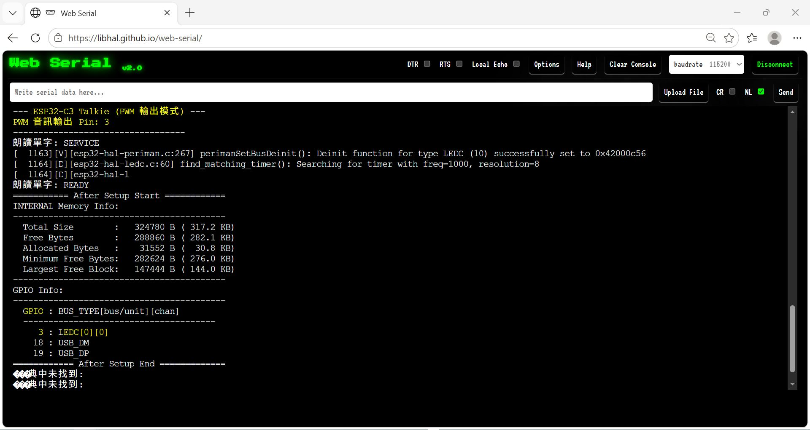
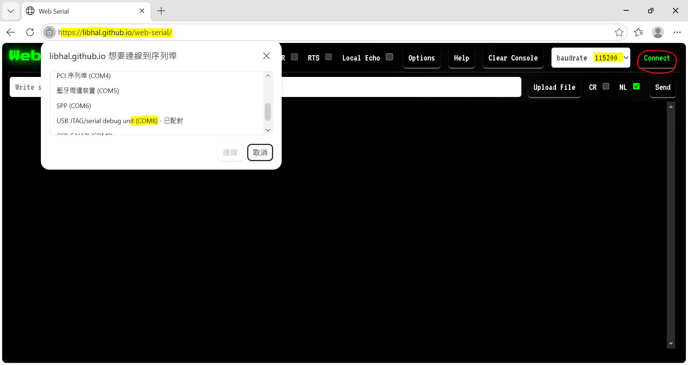

# Arduino_ESP32C3_super_mini_board_Text_To_Speech
experiment, default PWM output audio, ESP32-C3 has no DAC hardware, uses GPIO3 as PWM output channel (LEDC module), Talkie library 1.4.0 used.


read, LEDC for PWM audio output, https://docs.espressif.com/projects/esp-iot-solution/en/latest/audio/pwm_audio.html


### boot and done
  


### web serial, browser as terminal setup
    


### boot log

```
ESP-ROM:esp32c3-api1-20210207
Build:Feb  7 2021
rst:0x15 (USB_UART_CHIP_RESET),boot:0xd (SPI_FAST_FLASH_BOOT)
Saved PC:0x40053af8
SPIWP:0xee
mode:DIO, clock div:1
load:0x3fcd5820,len:0x110c
load:0x403cbf10,len:0xb54
load:0x403ce710,len:0x2f9c
entry 0x403cbf10
[     5][V][esp32-hal-periman.c:267] perimanSetBusDeinit(): Deinit function for type USB_DM (39) successfully set to 0x42003abc
[    16][V][esp32-hal-periman.c:192] perimanSetPinBus(): Pin 18 successfully set to type USB_DM (39) with bus 0x3fc90988
[    27][V][esp32-hal-periman.c:267] perimanSetBusDeinit(): Deinit function for type USB_DP (40) successfully set to 0x42003abc
[    38][V][esp32-hal-periman.c:192] perimanSetPinBus(): Pin 19 successfully set to type USB_DP (40) with bus 0x3fc90988
=========== Before Setup Start ===========
Chip Info:
------------------------------------------
  Model             : ESP32-C3
  Package           : 0
  Revision          : 0.04
  Cores             : 1
  CPU Frequency     : 160 MHz
  XTAL Frequency    : 40 MHz
  Features Bitfield : 0x00000012
  Embedded Flash    : No
  Embedded PSRAM    : No
  2.4GHz WiFi       : Yes
  Classic BT        : No
  BT Low Energy     : Yes
  IEEE 802.15.4     : No
------------------------------------------
INTERNAL Memory Info:
------------------------------------------
  Total Size        :   324780 B ( 317.2 KB)
  Free Bytes        :   284272 B ( 277.6 KB)
  Allocated Bytes   :    36300 B (  35.4 KB)
  Minimum Free Bytes:   282956 B ( 276.3 KB)
  Largest Free Block:   147444 B ( 144.0 KB)
------------------------------------------
Flash Info:
------------------------------------------
  Chip Size         :  4194304B (4 MB)
  Block Size        :    65536B (  64.0 KB)
  Sector Size       :     4096B (   4.0 KB)
  Page Size         :      256B (   0.2 KB)
  Bus Speed         : 80 MHz
  Flash Frequency   : 80 MHz (source: 80 MHz, divider: 1)
  Bus Mode          : QIO
------------------------------------------
Partitions Info:
------------------------------------------
                nvs : addr: 0x00009000, size:    20.0 KB, type: DATA, subtype: NVS
            otadata : addr: 0x0000E000, size:     8.0 KB, type: DATA, subtype: OTA
               app0 : addr: 0x00010000, size:  1280.0 KB, type:  APP, subtype: OTA_0
               app1 : addr: 0x00150000, size:  1280.0 KB, type:  APP, subtype: OTA_1
             spiffs : addr: 0x00290000, size:  1408.0 KB, type: DATA, subtype: SPIFFS
           coredump : addr: 0x003F0000, size:    64.0 KB, type: DATA, subtype: COREDUMP
------------------------------------------
Software Info:
------------------------------------------
  Compile Date/Time : Sep 15 2026 11:50:18
  Compile Host OS   : windows
  ESP-IDF Version   : v5.5.5
  Arduino Version   : 3.3.11
------------------------------------------
Board Info:
------------------------------------------
  Arduino Board     : ESP32C3_DEV
  Arduino Variant   : esp32c3
  Arduino FQBN      : esp32:esp32:esp32c3:JTAGAdapter=default,CDCOnBoot=cdc,PartitionScheme=default,CPUFreq=160,FlashMode=qio,FlashFreq=80,FlashSize=4M,UploadSpeed=921600,DebugLevel=verbose,EraseFlash=all,ZigbeeMode=default
============ Before Setup End ============
[   162][V][esp32-hal-uart.c:1085] uartSetPins(): UART0: Driver not yet installed, storing pins for later attachment (RX:20, TX:21)
[   162][I][esp32-hal-periman.c:170] perimanSetPinBus(): Pin 18 already has type USB_DM (39) with bus 0x3fc90988
[   163][I][esp32-hal-periman.c:170] perimanSetPinBus(): Pin 19 already has type USB_DP (40) with bus 0x3fc90988

--- ESP32-C3 Talkie (PWM 輸出模式) ---
PWM 音訊輸出 Pin: 3
----------------------------------
朗讀單字: SERVICE
[  1163][V][esp32-hal-periman.c:267] perimanSetBusDeinit(): Deinit function for type LEDC (10) successfully set to 0x42000c56
[  1164][D][esp32-hal-ledc.c:60] find_matching_timer(): Searching for timer with freq=1000, resolution=8
[  1164][D][esp32-hal-l
朗讀單字: READY
=========== After Setup Start ============
INTERNAL Memory Info:
------------------------------------------
  Total Size        :   324780 B ( 317.2 KB)
  Free Bytes        :   288860 B ( 282.1 KB)
  Allocated Bytes   :    31552 B (  30.8 KB)
  Minimum Free Bytes:   282624 B ( 276.0 KB)
  Largest Free Block:   147444 B ( 144.0 KB)
------------------------------------------
GPIO Info:
------------------------------------------
  GPIO : BUS_TYPE[bus/unit][chan]
  --------------------------------------  
     3 : LEDC[0][0]
    18 : USB_DM
    19 : USB_DP
============ After Setup End =============
```
